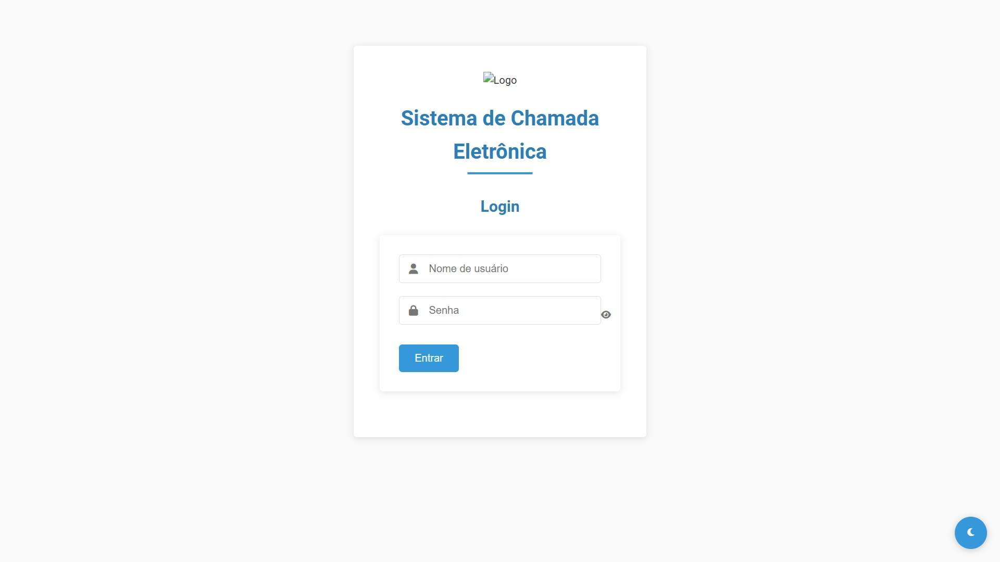
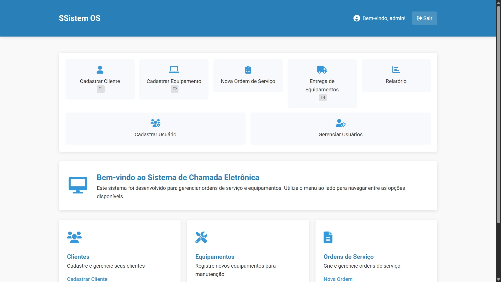
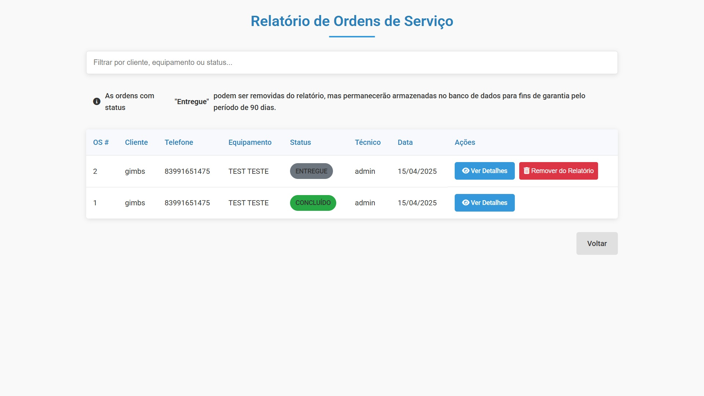
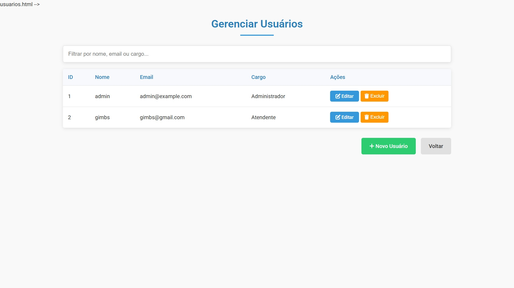

# Sistema de Gerenciamento de Ordens de Serviço



## Descrição
Sistema completo para gerenciamento de ordens de serviço, clientes e equipamentos desenvolvido em Python com Flask.

## Features Principais
- Cadastro de clientes e equipamentos
- Geração automática de códigos de barras
- Controle completo de ordens de serviço
- Relatórios e dashboard
- Autenticação segura com bcrypt

## Pré-requisitos
- Python 3.8+
- SQLite3
- Bibliotecas listadas em requirements.txt

## Instalação
1. Clone o repositório:
```bash
git clone https://github.com/seu-usuario/sistema-ordens-servico.git
cd sistema-ordens-servico
```

2. Crie e ative um ambiente virtual:
```bash
python -m venv venv
source venv/bin/activate  # Linux/Mac
venv\Scripts\activate     # Windows
```

3. Instale as dependências:
```bash
pip install -r requirements.txt
```

4. Configure o arquivo .env:
```bash
cp .env.example .env
```

5. Inicialize o banco de dados:
```bash
python create_admin.py
```

6. Execute a aplicação:
```bash
python app.py
```

## Uso
Acesse `http://localhost:5000` no seu navegador.

- Login padrão:
  - Usuário: admin
  - Senha: admin123

## Estrutura do Projeto
```
.
├── app.py                # Aplicação principal
├── create_admin.py       # Script de inicialização
├── requirements.txt      # Dependências
├── static/               # Arquivos estáticos
│   ├── css/              # Folhas de estilo
│   ├── js/               # JavaScript
│   └── uploads/          # Imagens e uploads
└── templates/            # Templates HTML
```

## Screenshots Adicionais




## Licença
MIT
